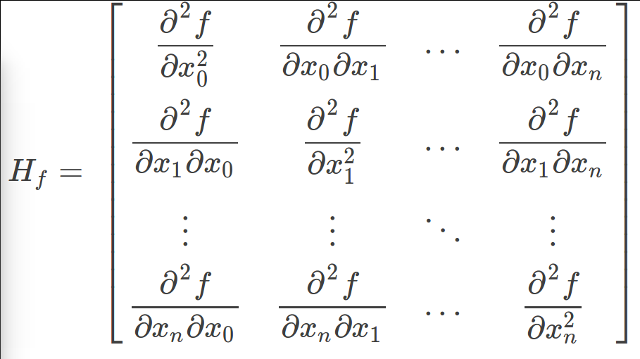
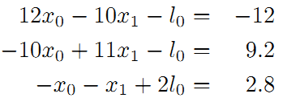

# 数学知识点滴
## 协方差 协方差矩阵
[协方差](https://www.zhihu.com/question/20852004/answer/134902061)
> 协方差是变量间的相关关系  Conv(X,Y)=SUM(Xi - EX)(Yi - EY)  两个变量所有时刻点对之间的相关关系之和，

> 同一时刻你比均值大，我也比均值大，就是正相关；同一时刻你比均值小，我也比均值小，也是正相关；同一时刻一个比均值大，一个比均值小，就是负相关；

> 所有时刻的相关性加和就是两个变量之间的协方差；如果两个变量独立，那么他们之间的协方差为0，同一个变量和自身的协方差，就是方差，就是标准差平方。

[协方差矩阵](https://zhuanlan.zhihu.com/p/24650651)
> 就是多个变量，两两之间的协方差，排列成的矩阵。

> 例如两个变量之间的协方差矩阵，维度就是 2*2 

> n个变量之间的协方差矩阵，维度就是 n*n

> 例如 独立随机变量 X 和 Y 的均值为0，标准差为1 和 2，则他们的协方差矩阵 为 |1 0; 0 4|

> 再如变量 X1 X2 X3 X4 X5 C=|Conv(X1,X1) Conv(X1,X2) Conv(X1,X3) Conv(X1,X4) Conv(X1,X5);...|

> 如果 X1 , ... ,  Xn 之间独立，则他们的协方差矩阵为 diag(Conv(X1,X1),...,Conv(Xn,Xn))

> 同时如果 X1, ,...,Xn 是多维变量，则他们的协方差矩阵为 diag(C1, ..., Cn)

## 逆矩阵 伪逆矩阵  矩阵转置
[现代视频](http://www.bilibili.com/video/av6731067/index_5.html#page=1)
> 转置  列与行互换    (A * B)转置 = B转置 * A转置     (A + B)转置 = A转置 +  B转置   (K * A)转置=K* A转置   A转置 * B = (B转置 * A)转置

> 逆矩阵，非奇异方矩阵，有逆矩阵，  A的伴随矩阵 除以 A的行列式   AB=BA=E, B成为A的逆

> 伪逆矩阵，是逆矩阵的广义形式，由于 奇异矩阵(行列式值为0) 或 非方阵的矩阵 不存在逆矩阵，但是有伪逆矩阵

> 一个与A的 转置矩阵A' 同型的矩阵X，并且满足:AXA=A, XAX=X, (AX)转置=AX  (XA)转置 = XA 此时，称矩阵X为矩阵A的伪逆，也称为广义逆矩阵。

## 协方差矩阵的传播
> 如果, X 的协方差为 C

> 变量组X的线性变换，f(X) = AX，则f(X)的协方差为 A * C * A转置  = (A转置 * C逆 * A)逆 = (A转置 * C逆 * A)伪逆

> 变量组X的线性变换 F(X)，一阶偏导数矩阵(雅克比矩阵，偏导数在均值处的值)为J，则F(X)的协方差为 J * C * J转置 = (J转置 * C逆 * J)逆 = (J转置 * C逆 * J)伪逆

## 数值优化
[牛顿法 高斯牛顿法 莱文贝格－马夸特方法](http://blog.csdn.net/liu14lang/article/details/53991897)
### 牛顿法
> 一般来说我们利用牛顿法使用来求f(x)=0的解。 先对f(x)一阶泰勒展开得 

> f(x+Δ)=f(x)+f′(x)Δ=0
 
> 所以我们有   Δ = x−x0 = −f(x0) / f′(x0), 即 x = x0 − f(x0) / f′(x0) 不断迭代优化

> 因此也就得到了我们的牛顿迭代公式：  xn = xn−1 − f(xn−1) / f′(xn−1)

### 求解最优化问题
> min　f(x)  牛顿法首先则是将问题转化为求 f′(x)=0

> 这个方程的根, 一阶展开：  f′(x) ≈ f′(x0) + (x－x0)f′′(x0)

> 令  f′(x0) + (x－x0)f′′(x0) = 0

> x = x0 − f'(x0) / f′'(x0) 不断迭代优化

## 高斯牛顿法
> 在讲牛顿法的时候，我们举的例子x是一维的，若如果我们遇到多维的x该如何办呢？这时我们就可以利用雅克比，海赛矩阵之类的来表示高维求导函数了。

> 例如 求 f(X)=0, 其中X=[x0,x1,...,xn]

> 所以我们有雅克比矩阵： 

> 有海赛矩阵

> 所以高维牛顿法解最优化问题又可写成： Xn+1 = Xn −  Hf(xn)逆 * ∇ * f(xn)

> 梯度(J) 代替了低维情况中的一阶导   Hessian矩阵代替了二阶导    求逆代替了除法 

> 有海赛矩阵的雅克比近似  H ≈ J转置 * J

> 高斯牛顿 迭代公式  Xn+1 = Xn −(J转置 * J)逆 * J转置 * f(xn)

## Levenberg-Marquardt算法 莱文贝格－马夸特方法
> 莱文贝格－马夸特方法（Levenberg–Marquardt algorithm）能提供数非线性最小化（局部最小）的数值解。此算法能借由执行时修改参数达到结合高斯-牛顿算法以及梯度下降法的优点，并对两者之不足作改善（比如高斯-牛顿算法之反矩阵不存在或是初始值离局部极小值太远）

> 在高斯牛顿迭代法中，我们已经知道 Δ = − (J转置 * J)逆 * J转置 * f(xn)

> 在莱文贝格－马夸特方法算法中则是 Δ = −(J转置 * J  + λI )逆 * J转置 * f(xn)

> Levenberg-Marquardt方法的好处就是在于可以调节

> 如果下降太快，使用较小的λ，使之更接近高斯牛顿法

> 如果下降太慢，使用较大的λ，使之更接近梯度下降法

# 最小二乘图优化   
## 闭环检测
> 假设一个机器人初始起点在0处x0，然后机器人向前移动，通过编码器测得它向前移动了1m，到达第二个地点x1。

> 接着，又向后返回到x2，编码器测得它向后移动了0.8米。

> 但是，通过闭环检测，发现它回到了原始起点。

> 可以看出，编码器误差导致计算的位姿和观测到有差异，那机器人这几个状态中的位姿到底是怎么样的才最好的满足这些条件呢

> 首先构建位姿之间的关系，即图的边

> 线性方程组中变量小于方程的个数（三个未知数，四个方程），要计算出最优的结果，使出杀手锏最小二乘法。先构建残差平方和函数：

> 为了使残差平方和最小，我们对上面的函数每个变量求偏导，并使得偏导数等于0.

> 整理得到

> 接着矩阵求解线性方程组

> 所以调整以后为满足这些边的条件，机器人的位姿为：
X0 = 0, X1 = 0.93, X2 = 0.07.

> 在这里例子中我们发现，闭环检测起了决定性的作用。

## 观测的路标（landmark）
> 上面是用闭环检测，这次用观测的路标（landmark）来构建边。如下图所示，假设一个机器人初始起点在0处，并观测到其正前方2m处有一个路标。然后机器人向前移动，通过编码器测得它向前移动了1m，这时观测到路标在其前方0.8m。请问，机器人位姿和路标位姿的最优状态

> 在这个图中，我们把路标也当作了一个顶点。构建边的关系如下

> 左边-右边 得到误差方程

> 残差平方和

> 求偏导数

> 最后整理并计算得

> 得到路标和机器人位姿 
X0 = 0, X1 = 1.07, l2 = 1.93

## 边的信息矩阵 边的 权重
> 将引入了一个重要的概念。我们知道传感器的精度是有差别的，也就是说我们对传感器的相信程度应该不同。比如假设这里编码器信息很精确，测得的路标距离不准，我们应该赋予编码器信息更高的权重，假设是10。

> 重新得到残差平方和如下

> c = sum(fi) = x0^2 + 10 * (x1 - x0 - 1)^2 + (l0 - x0 -2)^2 + (l0 - x1 - 0.8)^2

> 求偏导得到

> 转换为矩阵求逆矩阵得到解
X0 = 0, X1 = 1.01, l2 = 1.9

> 将这个结果和之前对比，可以看到这里的机器人位姿x1更靠近编码器测量的结果。请记住这种思想，这里的权重就是在后面将要经常提到的边的信息矩阵。

# 图优化理论分析
[图优化理论分析1](http://blog.csdn.net/heyijia0327/article/details/47731631)
[图优化理论分析2](http://www.cnblogs.com/gaoxiang12/p/5244828.html)
 > 由以上 实例分析可得：
 
 > 目标函数
 

> e 函数在原理上表示一个误差，是一个矢量，作为优化变量Xk和 实际值Zk符合程度的一个度量。

> 它越大表示xk越不符合zk。但是，由于目标函数必须是标量，所以必须用它的平方形式来表达目标函数。

> 最简单的形式是直接做成平方：e(x,z)转置 * e(x,z)。

> 进一步，为了表示我们对误差各分量重视程度的不一样，还使用一个信息矩阵 Ω 来表示各分量的不一致性。

> 信息矩阵 Ω 是协方差矩阵(ei 与 ej的相关性)的逆(即相关性越高，该误差项权重越小，或是 与该误差项的变量的准确度相关)，是一个对称矩阵。

> 它的每个元素Ωi,j作为ei, ej的系数，可以看成我们对ei,ej这个误差项相关性的一个预计。

> 最简单的是把Ω设成对角矩阵（各误差间独立），对角阵元素的大小表明我们对此项误差的重视程度。

> 这里的Xk可以指一个顶点、两个顶点或多个顶点，取决于边的实际类型。

> 所以，更严谨的方式是把它写成ek(Zk,Xk1,Xk2,…)，但是那样写法实在是太繁琐，我们就简单地写成现在的样子。

> 由于Zk是已知的，为了数学上的简洁，我们再把它写成ek(Xk)的形式。

> 于是总体优化问题变为n条边加和的形式：

> 边的具体形式有很多种，可以是一元边、二元边或多元边，它们的数学表达形式取决于传感器或你想要描述的东西。

> 例如视觉SLAM中，在一个相机Pose Tk 处对空间点xk进行了一次观测，得到zk，那么这条二元边的数学形式即为:

> 单个边其实并不复杂。

> 可以使用 高斯牛顿法进行迭代优化，需要知道 两样东西：一个初始点和一个迭代方向。为了数学上的方便，先考虑第k条边ek(Xk)吧。

> 我们假设它的初始点为x˜k，并且给它一个Δx的增量，那么边的估计值就变为Fk(x˜k + Δx)，而误差值则从 ek(x˜k) 变为 ek(x˜k + Δx)。

> 首先对误差项进行一阶展开：

> 这是的Jk是ek关于Xk的导数，矩阵形式下为雅可比阵。

> 我们在估计点附近作了一次线性假设，认为函数值是能够用一阶导数来逼近的，当然这在Δx很大时候就不成立了。

> 于是，对于第条边的目标函数项，进一步展开：

> 其中，矩阵转置性质  (A * B)转置 = B转置 * A转置；(A + B)转置 = A转置 + B转置；(K * A)转置=K* A转置；A转置 * B = (B转置 * A)转置

> 在熟练的同学看来，这个推导就像(a+b)^2=a^2 + 2ab + b^2一样简单。

> 最后一个式子是个定义整理式，我们把和Δx无关的整理成常数项 Ck，把一次项系数写成 2 * bk ，二次项则为 Hk（注意到二次项系数其实是Hessian矩阵）。

> 请注意 Ck 实际就是该边变化前的取值。所以在xk发生增量后，目标函数Fk项改变的值即为:

> ΔFk = 2 * bk * Δx + Δx转置 * Hk * Δx

> 我们的目标是找到Δx，使得这个增量变为极小值（Fk最小 不发生变化）。所以直接令它对于Δx的导数为零，有：

> dFk / dΔx = 2 * b + 2 * Hk * Δx = 0  得到 Hk * Δx  = −bk

> 所以归根结底，我们求解一个线性方程组：Hk * Δx = −bk

> 如果把所有边放到一起考虑进去，那就可以去掉下标，直接说我们要求解  : H * Δx = −b.   b里面含有一个雅克比矩阵，  Δx的系数为海塞矩阵

> 一阶导雅克比矩阵 和二阶导海塞矩阵 均为稀疏的矩阵，即大部分是零元素。

> 这种稀疏性能很好地帮助我们快速求解上面的线性方程。稀疏代数库包括SBA、PCG、CSparse、Cholmod等等。g2o正是使用它们来求解图优化问题的。

> 在数值计算中，我们可以给出雅可比和海塞的解析形式进行计算，也可以让计算机去数值计算这两个阵，而我们只需要给出误差的定义方式即可。

# 卡尔曼滤波器
[卡尔曼滤波](http://blog.csdn.net/heyijia0327/article/details/17487467)

# 粒子滤波器
[粒子滤波](http://blog.csdn.net/heyijia0327/article/details/40899819)

 
